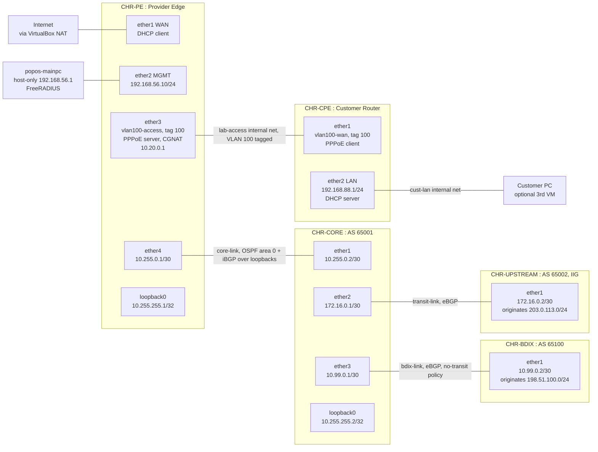

# MikroTik ISP Access Lab

A five-router RouterOS lab that reproduces a Bangladeshi ISP's network end to end: PPPoE
subscriber access authenticated against FreeRADIUS, deterministic CGNAT on RFC 6598 space,
OSPF backbone routing, BGP with a real BDIX no-transit peering policy, and the access-layer
firewall/VLAN/bandwidth/monitoring work from Phase 1. Built to close a specific gap ---
MikroTik is named in 6 of 14 real BD NOC/ISP job postings surveyed for this job search, and
it was the one skill on that list with zero evidence behind it.

Every claim below traces to a command that was actually run and a result that was actually
recorded. Nothing here is simulated or assumed.

## Topology

Full addressing table, adapter mapping and the reasoning behind the design in
[`docs/01-topology.md`](docs/01-topology.md).

## What's configured

**CHR-PE (provider edge)**
- Management access over SSH, host-only network, `telnet`/`ftp`/`api`/`api-ssl` disabled
- PPPoE server (`SakibNet`) on tagged VLAN 100, subscriber accounts authenticated against
  **FreeRADIUS** (running on the host) --- local secrets disabled, so RADIUS is genuinely in
  the auth path; RADIUS-assigned rate limits materialise as real dynamic queues
- **Deterministic CGNAT**: per-subscriber source-NAT port blocks on `100.64.0.0/24`
  (RFC 6598), RFC 6598 ingress filters, proven with live `reply-dst-port` captures showing
  two different subscribers landing in two different, non-overlapping port ranges
- Router syslog forwarding, 16 topics, proven emission -> arrival -> rsyslog ingestion
- Stateful input/forward firewall (accept established/related, drop invalid, management
  allow-list, default-deny from WAN)
- PCQ queue types and an aggregate simple queue for fair subscriber sharing
- SNMP exposed read-only for polling (the honest version of "MRTG-compatible")
- Netwatch uplink watchdog on `1.1.1.1`, logs on state change
- OSPF area 0 and iBGP (AS 65001) toward CHR-CORE over dedicated loopbacks

**CHR-CPE (customer router)**
- No NAT adapter of its own by design --- the only way it reaches the internet is by
  dialing the PPPoE session, which is the actual proof this is a real access network and
  not a shortcut
- PPPoE client on tagged VLAN 100, authenticated as a subscriber via RADIUS
- Customer LAN on `192.168.88.0/24` with its own DHCP server and NAT out through the
  PPPoE tunnel

**CHR-CORE, CHR-UPSTREAM, CHR-BDIX (backbone)**
- OSPF area 0 (PE-CORE) and BGP (AS 65001 on PE/CORE, AS 65002 on UPSTREAM simulating the
  IIG upstream, AS 65100 on BDIX simulating the local exchange)
- iBGP over loopbacks with `nexthop-choice=force-self`, demonstrated live against the
  classic iBGP next-hop problem --- disabling it made PE's route silently recurse through
  its own internet-facing NAT interface instead of failing cleanly
- BDIX peering policy: local-pref 200 on BDIX-learned routes (prefer the local exchange),
  an input filter accepting only BDIX's entitled prefix, and a **no-transit policy proven
  bidirectionally** --- neither peer ever sees the other's routes through this AS

## Reproduce it

Full step-by-step build log, including every mistake made and how it was diagnosed and
fixed, in [`docs/02-build-notes.md`](docs/02-build-notes.md) (Phase 1) and
[`docs/04-troubleshooting-log.md`](docs/04-troubleshooting-log.md) (Phase 2 --- RADIUS,
CGNAT, and the backbone). RouterOS config exports (credential-scrubbed via
`/export hide-sensitive`) are in [`configs/`](configs/).

## Verification

Every test in this lab was actually run against the live routers, not asserted. Full output
--- firewall counters, PPPoE session state on both ends, end-to-end ping and traceroute,
DHCP pool state, VLAN failover, bandwidth queue behaviour, SNMP polling, a watchdog test
performed by actually killing the WAN link, RADIUS Access-Accept/accounting records, live
CGNAT port-block captures, OSPF LSA flooding, and a live before/after/restore of the iBGP
next-hop problem --- is in [`docs/03-verification.md`](docs/03-verification.md).
Screenshots of the raw console output are in [`screenshots/`](screenshots/).

The single most load-bearing result: CHR-CPE has no NAT adapter, so a `traceroute` from it
to `1.1.1.1` can only succeed if the packets actually transit the PPPoE tunnel through
CHR-PE. They did --- first hop `10.20.0.1`, the PE.

## Limitations

Stated plainly, because this is what separates a real lab from CV padding:

- **The free CHR licence caps every interface at 1 Mbit/s**, regardless of the queue
  `max-limit` configured. Bandwidth shaping is correctly configured and demonstrably
  enforced (a per-subscriber dynamic queue counted real traffic during a load test), but
  it was never load-tested past that ceiling --- no number here claims otherwise.
- **This is a virtual lab.** No physical OLT, ONU, splitters or fibre plant --- those gaps
  are named openly rather than implied away, and `docs/05-gpon-olt-notes.md` is explicitly
  documented knowledge, not a claimed lab result, opening with that disclaimer itself.
- **Router syslog forwards to this host's own rsyslog, not the Wazuh SOC lab manager
  directly** --- `ether1` on CHR-PE is VirtualBox NAT, not bridged onto the real LAN where
  the Wazuh manager lives, so wiring it there directly is a deferred stretch goal, not this
  build's target. The emission -> arrival -> ingestion chain is proven end to end regardless.
- **BGP default-route origination (`0.0.0.0/0`) doesn't work via `output.network`** on this
  RouterOS version --- a specific prefix (`203.0.113.0/24`) was originated instead, which is
  sufficient for every proof this lab needed. See `docs/04-troubleshooting-log.md` entry 12.
- **MPLS LDP and a Zabbix monitoring VM were cut for time**, not silently dropped --- see
  `docs/03-verification.md`'s closing section for the reasoning. Everything else in the
  original Phase 2 plan (RADIUS, CGNAT, syslog, OSPF, BGP, BDIX no-transit policy, the GPON
  knowledge doc) is built and proven.
- **VLAN, PCQ queues, SNMP and the uplink watchdog are stretch work beyond the minimum
  ISP-access lab** --- Tasks 8 and 9 of the Phase 1 build plan --- included because they
  answer specific lines named across the surveyed job postings (bandwidth management,
  NMS/MRTG, monitoring and alerting), not added for their own sake.

## What this is not

Not a claim of production ISP experience. It is lab-configured evidence for a specific,
named skill gap, built and documented the same way the incidents in this repo were handled
--- honestly, with the mistakes left in.
