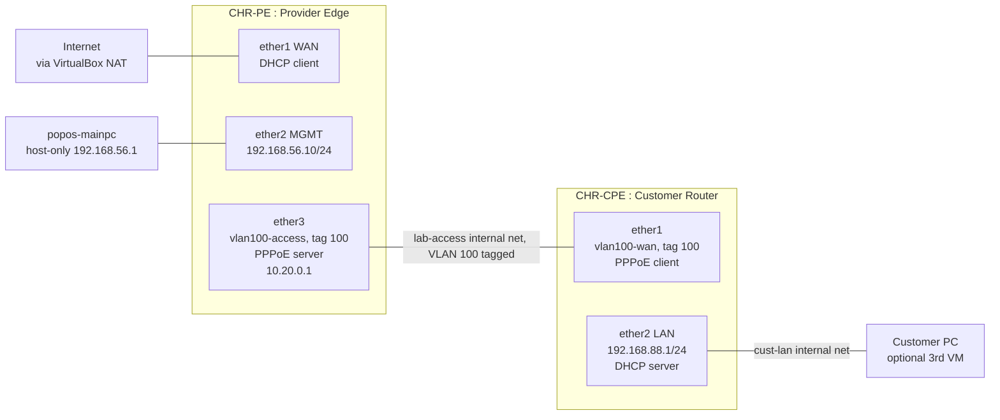

# MikroTik ISP Access Lab

A two-router RouterOS lab that reproduces a Bangladeshi ISP's PPPoE broadband access
network end to end: subscriber authentication, NAT, a stateful firewall, tagged-VLAN
access, per-subscriber bandwidth shaping, SNMP, and an uplink watchdog. Built to close a
specific gap --- MikroTik is named in 6 of 14 real BD NOC/ISP job postings surveyed for this
job search, and it was the one skill on that list with zero evidence behind it.

Every claim below traces to a command that was actually run and a result that was actually
recorded. Nothing here is simulated or assumed.

## Topology

Full addressing table, adapter mapping and the reasoning behind the design in
[`docs/01-topology.md`](docs/01-topology.md).

## What's configured

**CHR-PE (provider edge)**
- Management access over SSH, host-only network, `telnet`/`ftp`/`api`/`api-ssl` disabled
- Masquerade NAT for the WAN, stateful input/forward firewall (accept established/related,
  drop invalid, management allow-list, default-deny from WAN)
- PPPoE server (`SakibNet`) on tagged VLAN 100, two rate-limited subscriber profiles
  (5 Mbps / 10 Mbps), two subscriber accounts
- PCQ queue types and an aggregate simple queue for fair subscriber sharing
- SNMP exposed read-only for polling (the honest version of "MRTG-compatible")
- Netwatch uplink watchdog on `1.1.1.1`, logs on state change

**CHR-CPE (customer router)**
- No NAT adapter of its own by design --- the only way it reaches the internet is by
  dialing the PPPoE session, which is the actual proof this is a real access network and
  not a shortcut
- PPPoE client on tagged VLAN 100, authenticated as a subscriber
- Customer LAN on `192.168.88.0/24` with its own DHCP server and NAT out through the
  PPPoE tunnel

## Reproduce it

Full step-by-step build log, including every mistake made and how it was diagnosed and
fixed, in [`docs/02-build-notes.md`](docs/02-build-notes.md). RouterOS config exports
(credential-scrubbed via `/export hide-sensitive`) are in [`configs/`](configs/).

## Verification

Every test in this lab was actually run against the live routers, not asserted. Full output
--- firewall counters, PPPoE session state on both ends, end-to-end ping and traceroute,
DHCP pool state, VLAN failover, bandwidth queue behaviour, SNMP polling, and a watchdog
test performed by actually killing the WAN link and reading the resulting log --- is in
[`docs/03-verification.md`](docs/03-verification.md). Screenshots of the raw console
output are in [`screenshots/`](screenshots/).

The single most load-bearing result: CHR-CPE has no NAT adapter, so a `traceroute` from it
to `1.1.1.1` can only succeed if the packets actually transit the PPPoE tunnel through
CHR-PE. They did --- first hop `10.20.0.1`, the PE.

## Limitations

Stated plainly, because this is what separates a real lab from CV padding:

- **The free CHR licence caps every interface at 1 Mbit/s**, regardless of the queue
  `max-limit` configured. Bandwidth shaping is correctly configured and demonstrably
  enforced (a per-subscriber dynamic queue counted real traffic during a load test), but
  it was never load-tested past that ceiling --- no number here claims otherwise.
- **This is a virtual lab.** No physical OLT, ONU, splitters or fibre plant --- those gaps
  are named openly in application cover letters rather than implied away here.
- **PPPoE authentication is local** (`/ppp secret`), not RADIUS. RADIUS-backed
  authentication is Phase 2 of the build plan, not yet started.
- **Remote syslog to the Wazuh SOC lab manager was deferred**, not skipped silently --- the
  manager was unreachable when this was attempted and the session was ending for the
  night. Resume steps are in `docs/02-build-notes.md`.
- **VLAN, PCQ queues, SNMP and the uplink watchdog are stretch work beyond the minimum
  ISP-access lab** --- Tasks 8 and 9 of the build plan --- included because they answer
  specific lines named across the surveyed job postings (bandwidth management, NMS/MRTG,
  monitoring and alerting), not added for their own sake.

## What this is not

Not a claim of production ISP experience. It is lab-configured evidence for a specific,
named skill gap, built and documented the same way the incidents in this repo were handled
--- honestly, with the mistakes left in.
