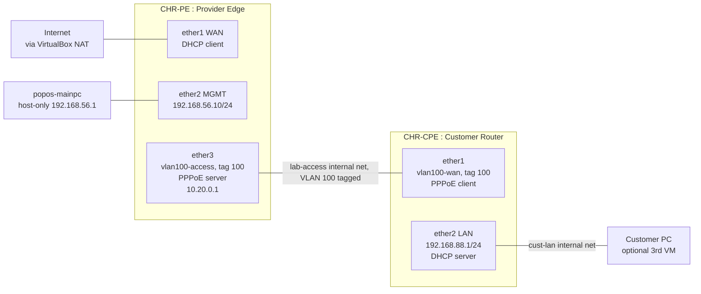

# Topology

Note: the PPPoE server and client originally ran untagged on `ether3`/`ether1`. Task 8 moved
both onto tagged VLAN 100 to match how real ISPs separate services on the access ring --- the
diagram reflects the current state, not the starting one.

## VirtualBox adapters

| VM | Adapter 1 | Adapter 2 | Adapter 3 |
|---|---|---|---|
| CHR-PE | NAT (internet) | Host-only `vboxnet0` | Internal Network `lab-access` |
| CHR-CPE | Internal Network `lab-access` | Internal Network `cust-lan` | --- |

RouterOS maps VirtualBox Adapter 1/2/3 to `ether1`/`ether2`/`ether3` in order. CHR-CPE
briefly carried a temporary fourth adapter (host-only, `ether3`) during Task 7 and again is
not present during Task 8, used only to pull config exports onto the host --- see
`docs/02-build-notes.md` for why it isn't part of the permanent design.

## Addressing

| Segment | Network | Gateway | Purpose |
|---|---|---|---|
| Management | 192.168.56.0/24 | 192.168.56.1 (host) | SSH admin access to CHR-PE |
| WAN | 10.0.2.0/24 (DHCP) | 10.0.2.2 | Upstream internet, via VirtualBox NAT |
| PPPoE subscribers | 10.20.0.0/24 | 10.20.0.1 | Broadband sessions, tagged VLAN 100 |
| Customer LAN | 192.168.88.0/24 | 192.168.88.1 | Behind the CPE, DHCP-served |
